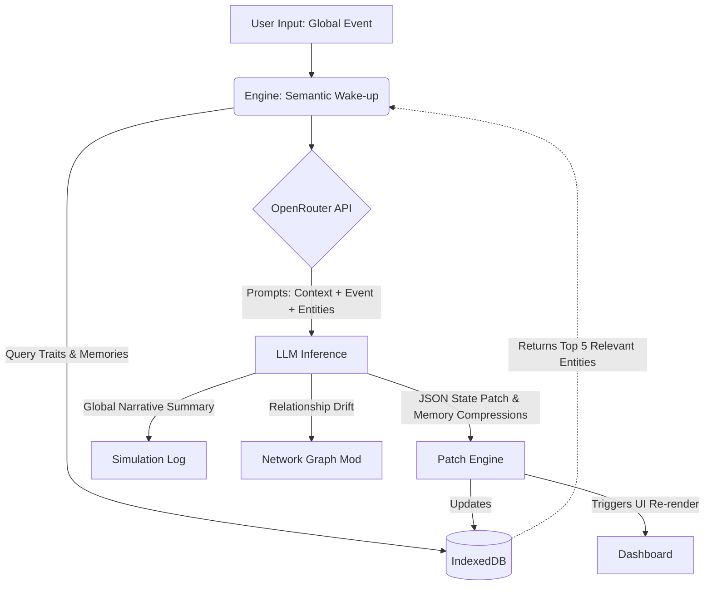

# 🐉 KirinByte
> A single-LLM predictive world simulation web application built with an Omniscient State Matrix.

[](https://reactjs.org/)
[](https://vitejs.dev/)
[](https://www.typescriptlang.org/)
[](https://tailwindcss.com/)
[](https://github.com/pmndrs/zustand)

**KirinByte** is an entirely client-side, browser-based world simulation engine. Instead of relying on expensive, multi-agent swarms where entities talk to each other directly, KirinByte utilizes a highly efficient **Omniscient State Matrix** approach combined with **Semantic Wake-up Routing**.

---

## 🏗 Architecture Overview

KirinByte achieves localized realism without the overhead of O(n²) agent interactions by feeding deterministic physics and state definitions into a single LLM forward pass.

### Tiered Memory System
1. **Tier 1 (Core State):** Global World Context, Global Event history (Tick Summaries), and Tick mechanisms (Powered by Zustand).
2. **Tier 2 (Active Memory):** The subset of entities "woken up" by the current global event.
3. **Tier 3 (Persistent State):** The sleeping matrix of all entities, archived and recent memories, relational dynamics, and raw statistical states (Powered by IndexedDB/Dexie).

### Execution Loop (Semantic Wake-up)


---

## ✨ Features
- **Client-Side Only:** No backend required. Your OpenRouter API key communicates directly from your browser.
- **Dynamic Societal Seeding:** Generate entirely unique starting entities and ideological factions on the fly based purely on the `World Context` input.
- **Analytical Simulation Lens (Prediction Goals):** Focus the engine's deterministic analysis towards a specific question (e.g. "Predict the outcome of the war") without biasing the AI towards a specific narrative outcome.
- **Reactive Network Graph:** Switch from the standard UI to a `react-force-graph` Societal Matrix view that visually maps how entities are connected via hidden funding, alliances, and hostilities.
- **PDF Context Parsing:** Instantly ingest complex geopolitical briefs or sci-fi world-building lore by uploading a `.pdf` file to use as the World Context via `pdfjs-dist`.
- **Granular Execution States:** Instead of a generic loading spinner, the engine tells you exactly what step of the calculation it is on (e.g., "Constructing Semantic Wake-up", "Patching Dimensional Timeline").
- **Semantic Wake-Up:** Employs substring heuristic scoring against entity traits and memories to determine who is affected by an event.
- **Auto-Compressing Memory:** Entities store up to 5 `recent_memory` items before the LLM natively compresses them into an `archival_memory` block, saving context tokens over long simulation runs.
- **Global Tick Summaries:** At the end of each simulation tick, the AI provides a narrative summary of the event's butterfly effect on the woken entities.

---

## 🚀 Getting Started

### Prerequisites
Make sure you have [Node.js](https://nodejs.org/) installed.

### Installation

1. Clone the repository:
   ```bash
   git clone https://github.com/juggperc/kirinbyte.git
   cd kirinbyte
   ```

2. Install dependencies:
   ```bash
   npm install
   ```

3. Start the development server:
   ```bash
   npm run dev
   ```

4. Open `http://localhost:5173` in your browser.

---

## 🎮 How to Play

1. **Configure:** Click the "Settings" button in the top right and enter your **OpenRouter API Key** and preferred **Model ID** (defaults to `deepseek/deepseek-chat`).
2. **Seed the World:** Click **Seed World Data** in the left sidebar to populate the IndexedDB with the starter pack of simulated entities (Tech CEOs, Crypto Whales, DAOs, AI bots, etc.).
3. **Set Context:** Optionally modify the `World Context` to set the geopolitical or economic stage.
4. **Trigger Events:** Type an event in the `Next Global Event` box (e.g., *"A massive solar flare knocks out internet in the Pacific"*).
5. **Execute Tick:** Click **Execute Tick**. The engine will wake up the most relevant entities, pass them to the LLM, and seamlessly update their financial status, alignment, and memories in real-time.

---

## 🛠 Tech Stack Details
- **Vite + React:** Lighting-fast frontend build tooling and UI framework.
- **TypeScript:** Strict structural typing for the JSON schemas mapping LLM outputs.
- **Zustand:** Dead-simple global state management for the simulation tick and API keys.
- **Dexie:** An excellent wrapper for IndexedDB allowing asynchronous relational querying for our semantic wake-up.
- **Shadcn UI & TailwindCSS:** Accessible, beautiful, headless UI components styled with utility classes.

---

*Built by a deterministic physics text engine.* 🌌